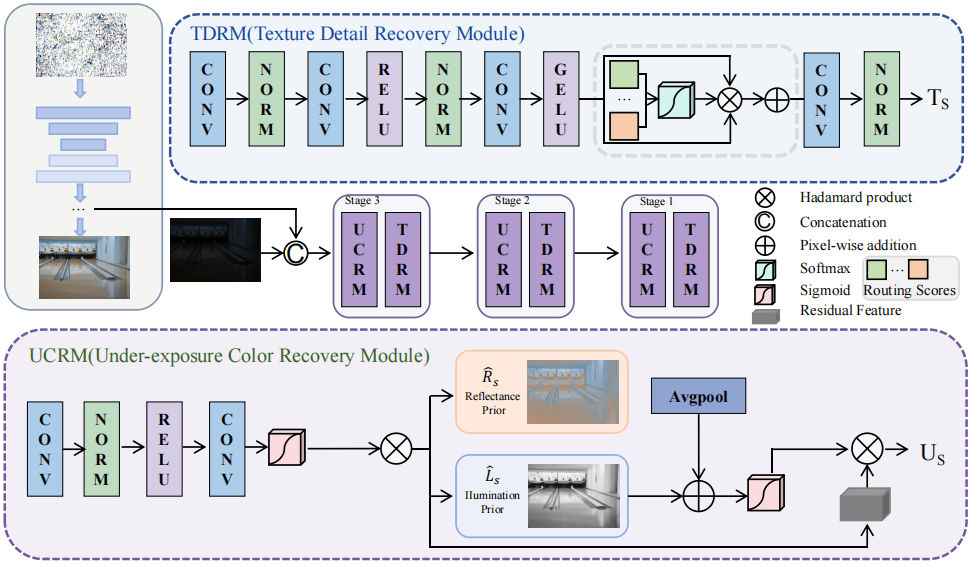

#  Retinex-Consistent and Time-Aware Diffusion for Low-Light Image Enhancement
### [Paper]() | [Code]([https://github.com/XunpengYi/Diff-Retinex-Plus](https://github.com/qy792832/PGER-LLIE)) 

**Retinex-Consistent and Time-Aware Diffusion for Low-Light Image Enhancement**
Minglong Xuea, Yi Qu, Zhenwei He, Palaiahnakote Shivakumarab,
Senming Zhong,∗
> **Notice:** The complete source code, including the training and evaluation scripts, will be uploaded by **July 25, 2026**. We apologize for the delay, as we have been occupied with some personal matters recently. Thank you for your patience and understanding.



## How to Run the Code?
* conda activate CTCR
* pip install -r requirements
### Dependencies

* OS: Ubuntu 22.04
* nvidia:
	- cuda: 12.1
* python 3.9

### Data Preparation

You can refer to the following links to download the datasets.

- [LOLv1](https://daooshee.github.io/BMVC2018website/)
- [LOLv2](https://github.com/flyywh/CVPR-2020-Semi-Low-Light)
- [LRSW](https://pan.baidu.com/s/1XHWQAS0ZNrnCyZ-bq7MKvA)(code: wmrr)

## Train
```python train.py ```

## Test
```python evaluate.py ```


